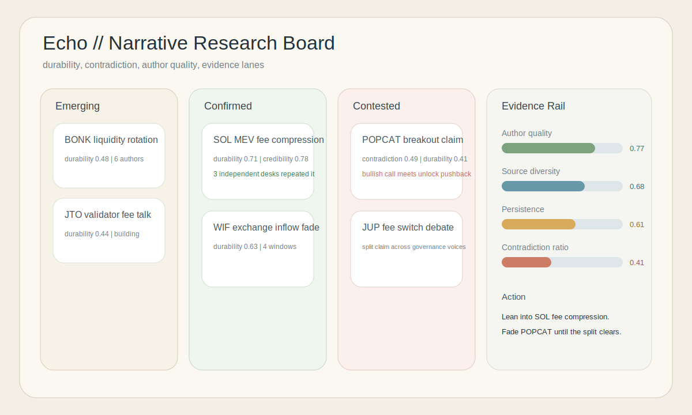
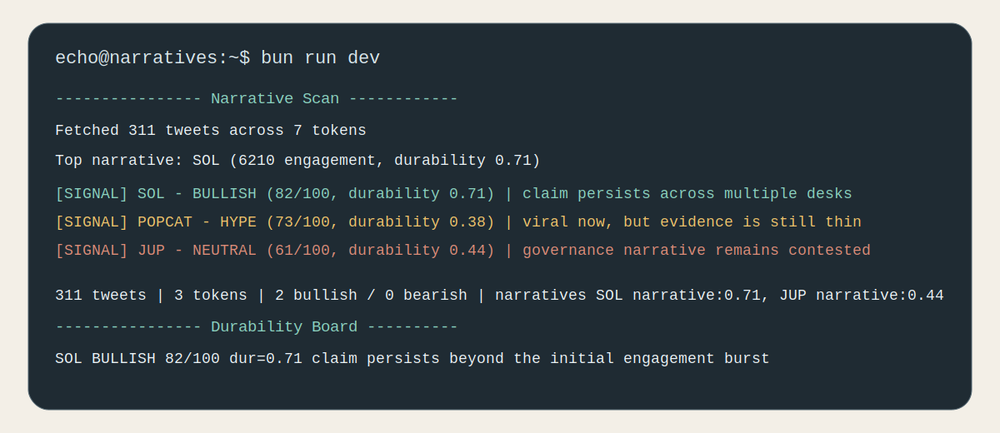

<div align="center">

# Echo

**Crypto Twitter narrative durability engine for Solana.**
Ranks claims by persistence, credibility, and contradiction instead of raw hype.

[](https://github.com/EchoSentiment/Echo/actions)

[](https://docs.anthropic.com/en/docs/agents-and-tools/claude-agent-sdk)
[](https://www.typescriptlang.org/)

</div>

---

Crypto Twitter is useful only when you can separate a durable market narrative from a one-hour engagement spike. A token can trend hard on CT and still fail if the claim came from weak accounts, died after one refresh cycle, or immediately attracted a credible opposing cluster.

`Echo` fetches recent tweets for tracked Solana symbols, models author credibility and source diversity, and then asks a Claude agent to decide whether each narrative is durable, contested, or fading. The output is a ranked board of narrative signals with action hints and explicit durability context.
It is intentionally skeptical of narratives that look large only because the same claim is being echoed in one cluster.

`FETCH -> AGGREGATE -> SCORE DURABILITY -> FLAG CONTESTED -> RANK`

---

## Research Board



---

## Terminal Output



---

## Technical Spec

Echo does not equate engagement with quality. Each token narrative is scored on four dimensions:

`Durability = 0.35 * credibility + 0.30 * source_diversity + 0.20 * persistence - 0.15 * contradiction_ratio`

Where:

- `credibility` blends author reach with observed engagement quality
- `source_diversity` rewards narratives repeated across different accounts and reply chains
- `persistence` increases when the same claim survives multiple windows instead of one spike
- `contradiction_ratio` rises when bearish and bullish evidence clusters stay active together

Operational rules:

- viral posts with weak persistence stay in `hype`, not `bullish`
- narratives above the contradiction threshold are marked `contested`
- score ordering is durability-adjusted, not raw engagement-only
- action hints should cite whether the edge comes from persistence, credibility, or a decaying claim

---

## Architecture

```text
Twitter fetch
  -> mention aggregation
  -> durability + contradiction scoring
  -> Claude narrative review
  -> ranked signal board
```

---

## Quick Start

```bash
git clone https://github.com/EchoSentiment/Echo
cd Echo && bun install
cp .env.example .env
bun run dev
```

---

## Configuration

```bash
ANTHROPIC_API_KEY=sk-ant-...
TWITTER_BEARER_TOKEN=...
AUTHOR_CREDIBILITY_WEIGHT=0.35
SOURCE_DIVERSITY_WEIGHT=0.30
PERSISTENCE_WEIGHT=0.20
CONTRADICTION_PENALTY_WEIGHT=0.15
NARRATIVE_HALF_LIFE_MINUTES=180
```

---

## Legitimacy Notes

- Planned commit sequence: [`docs/commit-sequence.md`](docs/commit-sequence.md)
- Draft engineering issues: [`docs/issue-drafts.md`](docs/issue-drafts.md)

---

## License

MIT

---

*read what lasts, not what trends for ten minutes.*
